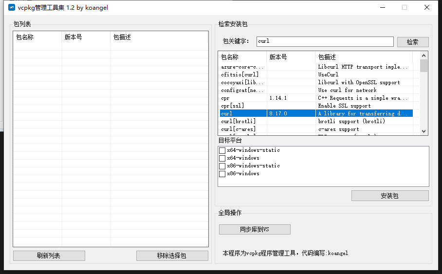
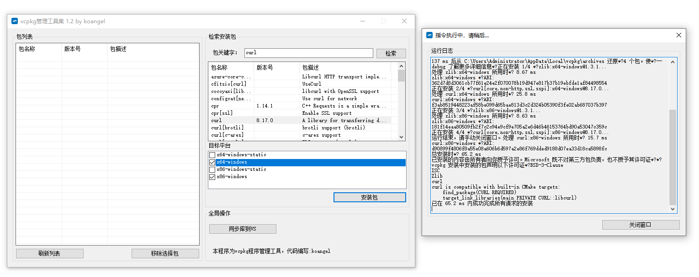
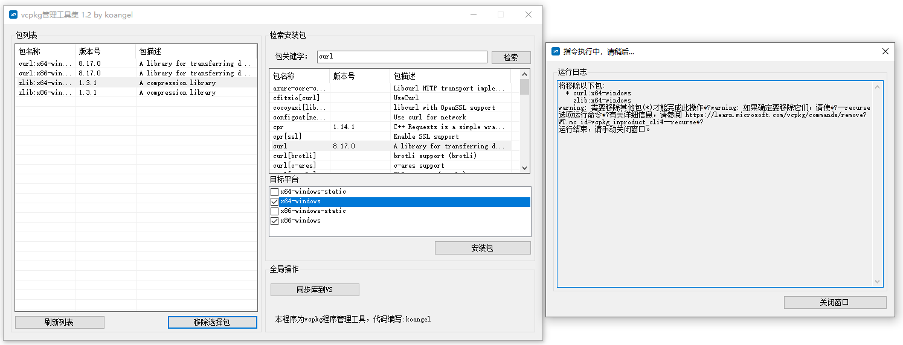

## vcpkg管理工具集 Gui

## 感谢原始作者 koangel 提供的初始版本！

工具主要用于快速安装vcpkg以及针对vcpkg之间的管理行为。

功能集：
- 自动安装vcpkg或针对已安装的进行设置
- 选择并安装指定库
- 可检索指定库
- 通过选项快速并行安装多个库
- 可快速移除各种指定库

开发语言：

```
C#
Visual Studio 2015
.Net 4.5
```


## vcpkg指令

vcpkg 是微软 C++ 团队开发的在 Windows 上运行的 C/C++ 项目包管理工具,可以帮助您在 Windows 平台上获取 C 和 C++ 库.

vcpkg 自身也是使用 C++ 开发的 (而其他的 C++ 包管理大多并不是 C++ 开发的),并且 vcpkg 能够帮助用户在 Visual Studio 中,更好的使用这些安装好的库.

vcpkg 整合了 git,构建系统整合的 CMake,而绝大多数的 C++ 项目都可以直接或者间接的方式使用 CMake创建原生项目文件并构建.

vcpkg遵循一下原则:

开放源码

无需安装

支持重发构建

自定义生成

社区参与贡献

端口集成(与 BSD Ports 机制类似)

安装和自举:
```
git clone https://github.com/Microsoft/vcpkg
cd vcpkg
powershell -exec bypass scripts\bootstrap.ps1
```

搜索库:
```
vcpkg search
```

安装库:
```
vcpkg install cpprestsdk
```

查看已安装的库:
```
vcpkg list
```

将库集成的 Visual Studio:

```
vcpkg integrate install
```

安装不同版本库：

```
arm-uwp.cmake
x64-uwp.cmake
x64-windows-static.cmake
x64-windows.cmake
x86-uwp.cmake
x86-windows-static.cmake
x86-windows.cmake
```

程序截图:





